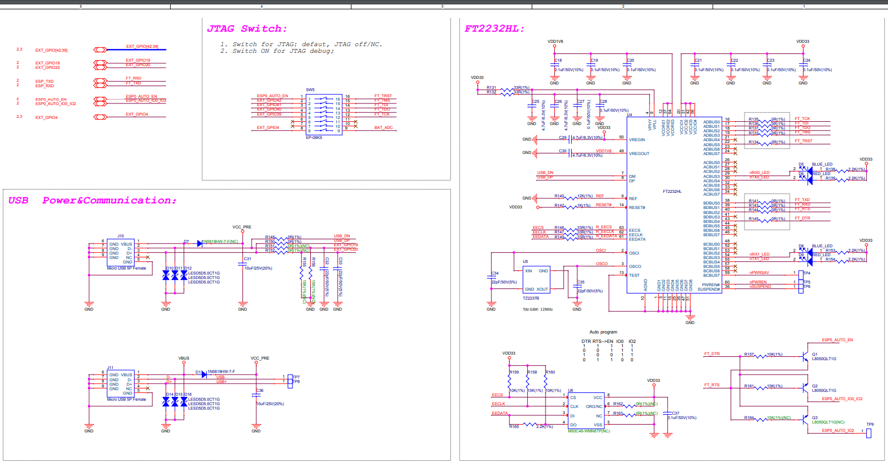

# esp32s2_kaluga
My exepriences with the esp32s2 kaluga dev board

# Mystery box
I was able to order one of 10 kaluga boards from Digikey on the 13/5, however I could not find much documentation about what I had actually ordered. Hovever I did find the schematics located here. https://github.com/espressif/esp-dev-kits/tree/master/esp32-s2-kaluga-1/docs It seems like we have an FT2232HL on board. Also I expect the LCD to be in the box. 

# JTAG debugging
I assume these instructions will help.
https://docs.espressif.com/projects/esp-idf/en/latest/esp32s2/api-guides/jtag-debugging/index.html
I would assume there is support in for the https://github.com/espressif/openocd-esp32 . 
It does not seem like that so we, have to create the configuration file ourselfs.

# esp32s2-wroom
I assume this is the one on the board. Nice to have 4MB of ram.
https://www.espressif.com/sites/default/files/documentation/esp32-s2-wroom_esp32-s2-wroom-i_datasheet_en.pdf

# esp32 technical reference.
https://www.espressif.com/sites/default/files/documentation/esp32-s2_technical_reference_manual_en.pdf
