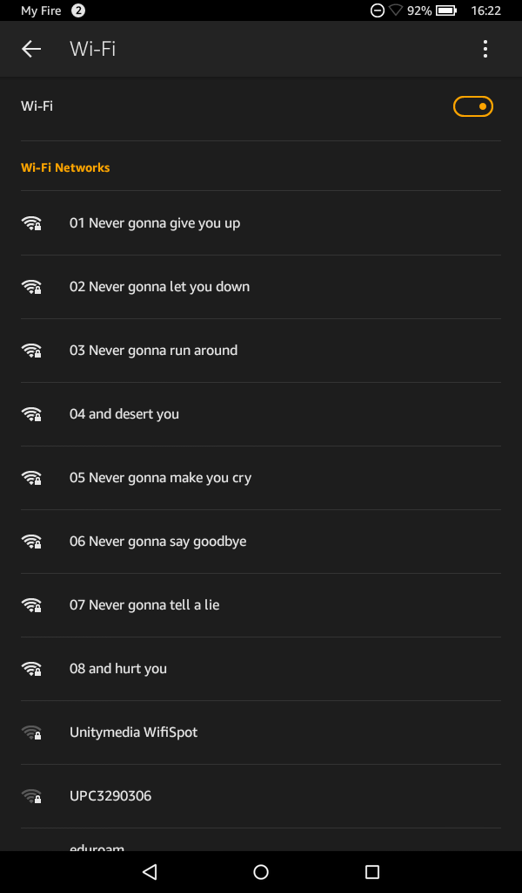

# `esp_wifi_80211_tx` sample code


# Origin
https://github.com/Jeija/esp32-80211-tx

## Introduction
Sending arbitrary IEEE 802.11 frames can be useful in various ways, e.g. for mesh networking, [unidirectional long-distance communication](https://www.youtube.com/watch?v=tBfa4yk5TdU) or low-overhead data transmission. It can, however, be abused for spamming large numbers of invalid SSIDs, jamming WiFi networks or sending deauthentication frames in order to sniff SSIDs of hidden wireless networks. Please be advised that such usage is morally doubtful at best and illegal at worst. Use this at your own risk.

Espressif have now created the `esp_wifi_80211_tx` API, making [esp32free80211](https://github.com/Jeija/esp32free80211) obsolete. The new function is thoroughly documented **[in the API guide](https://github.com/espressif/esp-idf/blob/master/docs/en/api-guides/wifi.rst#wi-fi-80211-packet-send)**. Since at the time of writing not a lot of sample code using `esp_wifi_80211_tx` exists and many developers wanting to send arbitrary data with their ESP32s end up using [esp32free80211](https://github.com/Jeija/esp32free80211) with an outdated [esp-idf](https://github.com/espressif/esp-idf) version, I want to hereby provide some more up-to-date sample code for `esp_wifi_80211_tx`.

## Project Description
In order to demonstrate the freedom output functionality, this software broadcasts the infamous lines from Rick Astley's `Never gonna give you up`. This is achieved by manually assembling IEEE 802.11 beacon frames in `main.c` and broadcasting them via the currently unofficial `esp_wifi_80211_tx` API in Espressif's [esp32-wifi-lib](https://github.com/espressif/esp32-wifi-lib).

If you want to use raw packet sending functionality in your own project, just declare the `esp_wifi_80211_tx` function like this:
```C
// buffer: Raw IEEE 802.11 packet to send
// len: Length of IEEE 802.11 packet
// en_sys_seq: see https://github.com/espressif/esp-idf/blob/master/docs/api-guides/wifi.rst#wi-fi-80211-packet-send for details
esp_err_t esp_wifi_80211_tx(wifi_interface_t ifx, const void *buffer, int len, bool en_sys_seq);
```

# 802.11 Frame header


MAC layer provides functionality for several tasks like control medium access, can also offer support for roaming, authentication, and power conservation. The basic services provided by MAC are the mandatory asynchronous data service and an optional time-bounded service.
IEEE 802.11 defines two MAC sub-layers 

    Distributed Coordination Function (DCF) –
    DCF uses CSMA/CA as access method as wireless LAN can’t implement CSMA/CD. It only offers asynchronous service.
    Point Coordination Function (PCF) –
    PCP is implemented on top of DCF and mostly used for time-service transmission. It uses a centralized, contention-free polling access method. It offers both asynchronous and time-bounded service.

MAC Frame:
The MAC layer frame consist of 9 fields. The following figure shows the basic structure of an IEEE 802.11 MAC data frame along with the content of the frame control field.


    Frame Control(FC) –
    It is 2 bytes long field which defines type of frame and some control information. Various fields present in FC are:

### Version
        It is a 2 bit long field which indicates the current protocol version which is fixed to be 0 for now.
        Type:
        It is a 2 bit long field which determines the function of frame i.e management(00), control(01) or data(10). The value 11 is reserved.
### Subtype
        It is a 4 bit long field which indicates sub-type of the frame like 0000 for association request, 1000 for beacon.
### To DS
        It is a 1 bit long field which when set indicates that destination frame is for DS(distribution system).
### From DS
        It is a 1 bit long field which when set indicates frame coming from DS.
### More frag (More fragments)
        It is 1 bit long field which when set to 1 means frame is followed by other fragments.
### Retry
        It is 1 bit long field, if the current frame is a retransmission of an earlier frame, this bit is set to 1.
###  Power Mgmt (Power management)
        It is 1 bit long field which indicates the mode of a station after successful transmission of a frame. Set to 1 the field indicates that the station goes into power-save mode. If the field is set to 0, the station stays active.
### More data
        It is 1 bit long field which is used to indicates a receiver that a sender has more data to send than the current frame. This can be used by an access point to indicate to a station in power-save mode that more packets are buffered or it can be used by a station to indicate to an access point after being polled that more polling is necessary as the station has more data ready to transmit.
### WEP
        It is 1 bit long field which indicates that the standard security mechanism of 802.11 is applied.
### Order
        It is 1 bit long field, if this bit is set to 1 the received frames must be processed in strict order.


### Duration/ID 
    It is 4 bytes long field which contains the value indicating the period of time in which the medium is occupied(in µs).


###   Address 1 to 4 
    These are 6 bytes long fields which contain standard IEEE 802 MAC addresses (48 bit each). The meaning of each address depends on the DS bits in the frame control field.


### SC (Sequence control) 
    It is 16 bits long field which consists of 2 sub-fields, i.e., Sequence number (12 bits) and Fragment number (4 bits). Since acknowledgement mechanism frames may be duplicated hence, a sequence number is used to filter duplicate frames.


### Data 
    It is a variable length field which contain information specific to individual frames which is transferred transparently from a sender to the receiver(s).


### CRC (Cyclic redundancy check) 
    It is 4 bytes long field which contains a 32 bit CRC error detection sequence to ensure error free frame.


### Compile / Flash
This project uses the [Espressif IoT Development Framework](https://github.com/espressif/esp-idf). With the ESP-IDF installed, execute
```
make menuconfig
```
and configure the SDK to use your preferred settings (baudrate, python2 executable, serial flasher port, …) and proceed to compile and flash this project using
```
make flash
```

# More info
https://esp32.com/viewtopic.php?f=13&t=586&p=2648&hilit=Wi-Fi_send_pkt_freedom#p2648


## Project License: MIT
```
Permission is hereby granted, free of charge, to any person obtaining a copy of this software and associated documentation files (the "Software"), to deal in the Software without restriction, including without limitation the rights to use, copy, modify, merge, publish, distribute, sublicense, and/or sell copies of the Software, and to permit persons to whom the Software is furnished to do so, subject to the following conditions:

The above copyright notice and this permission notice shall be included in all copies or substantial portions of the Software.

THE SOFTWARE IS PROVIDED "AS IS", WITHOUT WARRANTY OF ANY KIND, EXPRESS OR IMPLIED, INCLUDING BUT NOT LIMITED TO THE WARRANTIES OF MERCHANTABILITY, FITNESS FOR A PARTICULAR PURPOSE AND NONINFRINGEMENT. IN NO EVENT SHALL THE AUTHORS OR COPYRIGHT HOLDERS BE LIABLE FOR ANY CLAIM, DAMAGES OR OTHER LIABILITY, WHETHER IN AN ACTION OF CONTRACT, TORT OR OTHERWISE, ARISING FROM, OUT OF OR IN CONNECTION WITH THE SOFTWARE OR THE USE OR OTHER DEALINGS IN THE SOFTWARE.
```
