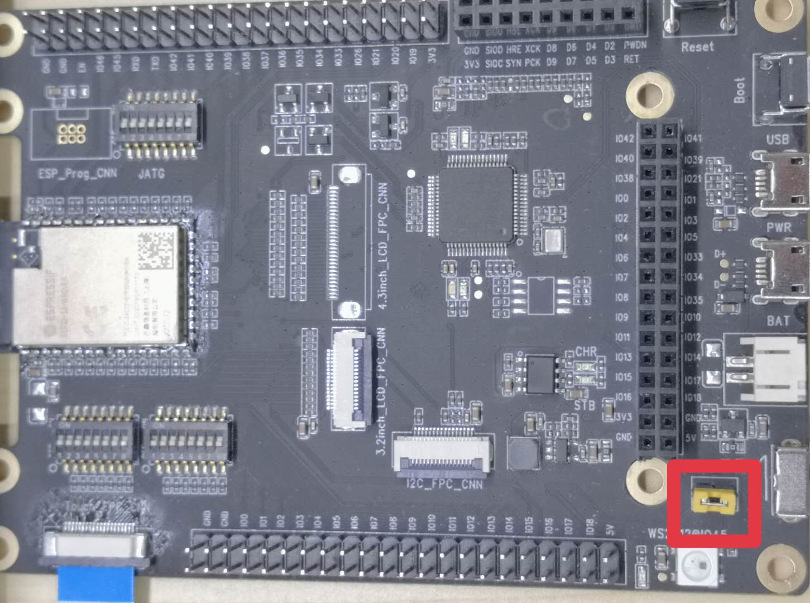

# LED example program_

This function mainly blinks with the LED connected to pin 45 if jumper is set.

## 1 Quick Start


### 1.2 Hardware connection


1. Short-circuit the two pins reserved on GPIO45, as shown below:
<div align = "left">  </ div>

### 1.3 Configure software

```
idf.py set-target esp32s2 menuconfig
```

* Configure serial port related information under `Serial flasher config`.
* Set `Example Configuration`->` WS2812 GPIO`: configure the GPIO pin of the LED light. (45)
* Set `Example Configuration`->` Number of LEDS in a strip`: the number of connected lights.
* Set `Example Configuration`->` touch pad type`: select the motherboard version.
  
### 1.4 Build and flash

Build the project and flash it into the board, then run the monitoring tool to view the serial output:

```
idf.py -p PORT flash monitor
```

* If there are two port numbers, the largest one is `PORT`. i.e. /dev/ttyUSB1

(To exit the serial monitor, type "Ctrl-]")

For the complete steps to configure and use ESP-IDF to build a project, please refer to the Getting Started Guide.


# Debuging with openocd
```
xtensa-esp32s2-elf-gdb build/led.elf -ex 'target remote:3333'
```


### 1.5 Sample output

When the program is burned in, you will see the following scene, then the burn is successful.

You can also see the following output log on the serial monitor:

```
ESP-ROM:esp32s2-rc4-20191025
Build:Oct 25 2019
rst:0x1 (POWERON),boot:0x8 (SPI_FAST_FLASH_BOOT)
SPIWP:0xee
mode:DIO, clock div:2
load:0x3ffe8100,len:0x4
load:0x3ffe8104,len:0x17f4
load:0x40050000,len:0x14b0
load:0x40054000,len:0x210c
entry 0x400502d8
I (48) boot: ESP-IDF v4.2-dev-1415-ga2263571b-dirty 2nd stage bootloader
I (48) boot: compile time 01:57:58
I (48) boot: chip revision: 0
I (52) boot.esp32s2: SPI Speed      : 40MHz
I (57) boot.esp32s2: SPI Mode       : DIO
I (61) boot.esp32s2: SPI Flash Size : 2MB
I (66) boot: Enabling RNG early entropy source...
I (71) boot: Partition Table:
I (75) boot: ## Label            Usage          Type ST Offset   Length
I (82) boot:  0 nvs              WiFi data        01 02 00009000 00006000
I (90) boot:  1 phy_init         RF data          01 01 0000f000 00001000
I (97) boot:  2 factory          factory app      00 00 00010000 00100000
I (105) boot: End of partition table
I (109) esp_image: segment 0: paddr=0x00010020 vaddr=0x3f000020 size=0x05d24 ( 23844) map
I (125) esp_image: segment 1: paddr=0x00015d4c vaddr=0x3ffbe5d0 size=0x01e98 (  7832) load
I (129) esp_image: segment 2: paddr=0x00017bec vaddr=0x40024000 size=0x00404 (  1028) load
0x40024000: _WindowOverflow4 at /home/olof/esp/esp-idf/components/freertos/xtensa/xtensa_vectors.S:1730

I (136) esp_image: segment 3: paddr=0x00017ff8 vaddr=0x40024404 size=0x08020 ( 32800) load
I (156) esp_image: segment 4: paddr=0x00020020 vaddr=0x40080020 size=0x15150 ( 86352) map
0x40080020: _stext at ??:?

I (180) esp_image: segment 5: paddr=0x00035178 vaddr=0x4002c424 size=0x021ac (  8620) load
0x4002c424: rtc_clk_cpu_freq_get_config at /home/olof/esp/esp-idf/components/soc/src/esp32s2/rtc_clk.c:433

I (189) boot: Loaded app from partition at offset 0x10000
I (189) boot: Disabling RNG early entropy source...
I (189) cache: Instruction cache 	: size 8KB, 4Ways, cache line size 32Byte
I (197) cache: Data cache 		: size 8KB, 4Ways, cache line size 32Byte
I (204) spiram: Found 16MBit SPI RAM device
I (209) spiram: SPI RAM mode: sram 40m
I (213) spiram: PSRAM initialized, cache is in normal (1-core) mode.
I (220) cpu_start: Pro cpu up.
I (224) cpu_start: Application information:
I (229) cpu_start: Project name:     led
I (233) cpu_start: App version:      6a7656d-dirty
I (239) cpu_start: Compile time:     May 16 2020 01:57:45
I (245) cpu_start: ELF file SHA256:  00763d73ee9854a8...
I (251) cpu_start: ESP-IDF:          v4.2-dev-1415-ga2263571b-dirty
I (258) cpu_start: Single core mode
I (673) spiram: SPI SRAM memory test OK
I (673) heap_init: Initializing. RAM available for dynamic allocation:
I (673) heap_init: At 3FFC0CC0 len 0003B340 (236 KiB): DRAM
I (679) heap_init: At 3FFFC000 len 00003A10 (14 KiB): DRAM
I (686) cpu_start: Pro cpu start user code
I (690) spiram: Adding pool of 2048K of external SPI memory to heap allocator
I (698) spiram: Reserving pool of 32K of internal memory for DMA/internal allocations
I (761) spi_flash: detected chip: generic
I (762) spi_flash: flash io: dio
W (762) spi_flash: Detected size(4096k) larger than the size in the binary image header(2048k). Using the size in the binary image header.
I (772) cpu_start: Starting scheduler on PRO CPU.
I (779) Led test: Initializing WS2812
starting
Free heap size 2319664
ALLOCS: 1/20, SIZE 1048576/1048576
ALLOCS: 2/20, SIZE 524288/1572864
ALLOCS: 3/20, SIZE 262144/1835008
ALLOCS: 4/20, SIZE 131072/1966080
ALLOCS: 5/20, SIZE 131072/2097152
ALLOCS: 6/20, SIZE 65536/2162688
ALLOCS: 7/20, SIZE 65536/2228224
ALLOCS: 8/20, SIZE 32768/2260992
ALLOCS: 9/20, SIZE 16384/2277376
ALLOCS: 10/20, SIZE 8192/2285568
ALLOCS: 11/20, SIZE 8192/2293760
ALLOCS: 12/20, SIZE 8192/2301952
ALLOCS: 13/20, SIZE 4096/2306048
ALLOCS: 14/20, SIZE 4096/2310144
ALLOCS: 15/20, SIZE 2048/2312192
ALLOCS: 16/20, SIZE 2048/2314240
ALLOCS: 17/20, SIZE 2048/2316288
ALLOCS: 18/20, SIZE 1024/2317312
ALLOCS: 19/20, SIZE 512/2317824
ALLOCS: 20/20, SIZE 512/2318336
Free heap size 1248
free idx 19
free idx 18
free idx 17
free idx 16
free idx 15
free idx 14
free idx 13
free idx 12
free idx 11
free idx 10
free idx 9
free idx 8
free idx 7
free idx 6
free idx 5
free idx 4
free idx 3
free idx 2
free idx 1
free idx 0
Free heap size 2319664
```
  
### 1.6 Troubleshooting

* Burn failed
  * The hardware connection is incorrect: run `idf.py monitor` and then restart the board to see if there are any output logs.
  * The download baud rate is too high: lower the baud rate in the `menuconfig` menu and try again.
  * GPIO45/LED jumper is not shorted.
  
